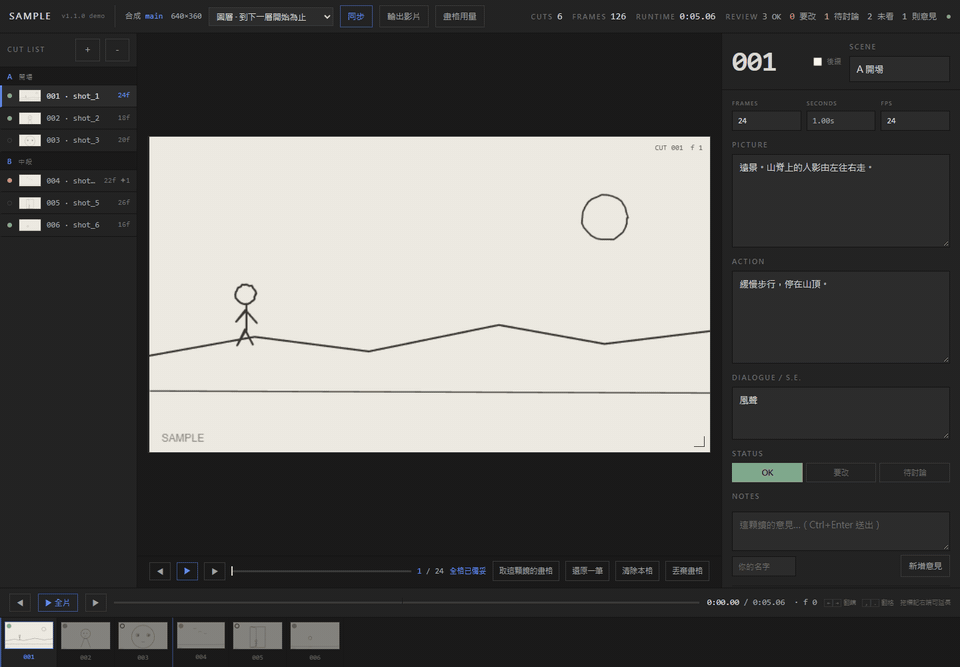
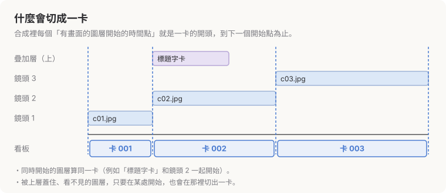
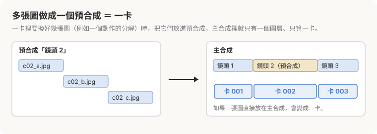

# CENTO — After Effects 分鏡看板（測試版）

> 在 AE 裡審分鏡，不用再截圖、貼簡報、對卡號。

畫面為示意用的範例分鏡 / sample storyboard for illustration

**CENTO** 把合成裡的鏡頭讀成一張看板：逐格檢視、直接在畫面上畫標記、每一卡留意見與狀態，最後一鍵輸出帶卡號、標記與聲音的審片影片。**不會改動你的 AE 專案。**

**➜ [下載測試版（Windows）](https://github.com/hsuhaocheng/cento2026-demo/releases/latest/download/cento-demo-win.zip)　·　[填寫回饋表單](https://forms.gle/M2zJ1emx3J9fPmCz8)**

| | |
|---|---|
| 同步鏡頭 | 從合成讀出每一卡的起點、長度與代表畫面 |
| 卡號 | 自動編號，支援空號與 24A 這類後綴卡；AE 裡刪卡、加卡後同步，資料跟著卡走 |
| 標記與意見 | 在任何一格上手繪，可設定停留幾格；每卡留意見、標 OK／要改／待討論 |
| 輸出 | MOV（H.264，可含聲音）或 WebM，合併或每卡一支，逐格精準 |

## 運作方式

### 什麼會切成一卡

合成裡每個有畫面的圖層開始的時間點，就是一卡的開頭。調整圖層、空物件、文字圖層、音訊圖層不算。**被蓋住的圖層也算**：某一卡被莫名切成兩卡時，通常是那裡有個看不見的圖層開始了。

### 多張圖做成一個預合成 ＝ 一卡

一卡裡要換好幾張圖時，選取那些圖層按 **Ctrl+Shift+C** 做成預合成，主合成裡就只有一個圖層、只算一卡。

### 刪卡、加卡之後的卡號

卡號不存死，每次同步都照順序重算。同步後，CENTO 會列出 AE 裡刪掉和新增的卡：

- 刪掉的卡按「**留空號**」，它的卡號會保留成空格，後面的卡號不動。
- 新增的卡按「**改成後綴**」，它會變成前一卡的 A、B…，後面的卡號不動。
- 什麼都不按就是遞補。

文字、意見、狀態、標記都跟著卡走，不會因為卡號改變而錯位。之後想改，也可以在右側勾「後綴」，或用清單上方的「＋」「－」插入、刪除空號。

## 安裝（Windows）

1. 下載 [cento-demo-win.zip](https://github.com/hsuhaocheng/cento2026-demo/releases/latest/download/cento-demo-win.zip) 並解壓縮（[所有版本](../../releases)）
2. 關閉 After Effects，雙擊 `install.cmd`
3. 開 AE：**視窗 → 延伸功能 → CENTO**

需求：After Effects 2022 以上、Windows 10／11。macOS 尚未支援。

## 這是測試版

- 免費，可以用在自己的案件（包括商業案件）。輸出的影片右下角有淡浮水印。
- 請勿散布安裝檔（請分享這個頁面）、修改、轉售或移除浮水印。詳見 [LICENSE](LICENSE)。
- 已知限制：
  - 只在 Windows + AE 2022 上驗證過
  - 聲音不套用 AE 裡的音量與關鍵影格；預合成內的聲音不會輸出
  - 被上層蓋住的圖層仍會在它開始的位置切出一卡
- 遇到問題或想要什麼功能，請填 [回饋表單](https://forms.gle/M2zJ1emx3J9fPmCz8)。想收到正式版消息，也可以在表單留下 Email，或按右上角 **Watch**。

---

# CENTO — storyboard review in After Effects (demo)

> Review your animatic inside AE — no more screenshots, slide decks and cut-number spreadsheets.

CENTO reads the shots of a comp into a board: step through frames, draw on them, leave notes and a status per cut, and export a review video with cut numbers, marks and sound burned in. **Your AE project is never modified.**

**➜ [Download the demo (Windows)](https://github.com/hsuhaocheng/cento2026-demo/releases/latest/download/cento-demo-win.zip) · [Feedback form](https://forms.gle/M2zJ1emx3J9fPmCz8)**

**How cuts work:** a cut starts wherever a layer with pictures starts in the comp (layers hidden under others count too). Put several pictures into one precomp and they are one cut. Cut numbers are recounted on every sync: by default later numbers close up; keep a deleted cut as a **blank** or make a new one a **suffix** (024A) so nobody else's numbers change. See the diagrams above.

**Install (Windows):** download and extract, close AE, double-click `install.cmd`, then open **Window → Extensions → CENTO**. Needs After Effects 2022+ on Windows 10/11; macOS is not supported yet.

**Demo terms:** free, including for commercial projects of your own. Exports carry a faint watermark. Please don't redistribute the installer (share this page), modify, resell, or remove the watermark — see [LICENSE](LICENSE). Verified on Windows + AE 2022 only; sound ignores AE volume/keyframes and precomp audio.

Found a bug or want a feature? Use the [feedback form](https://forms.gle/M2zJ1emx3J9fPmCz8). Leave your email there, or **Watch** this repo, to hear about the full version.

授權 / License: [LICENSE](LICENSE)
